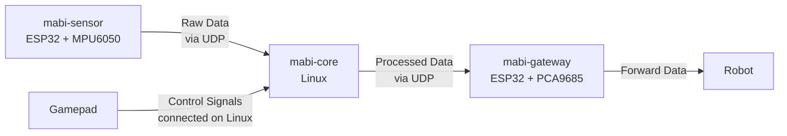
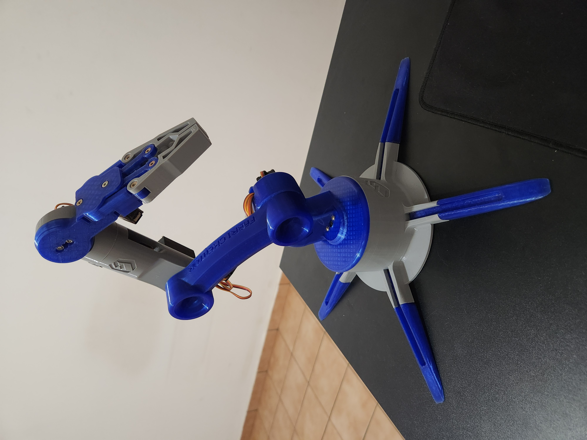
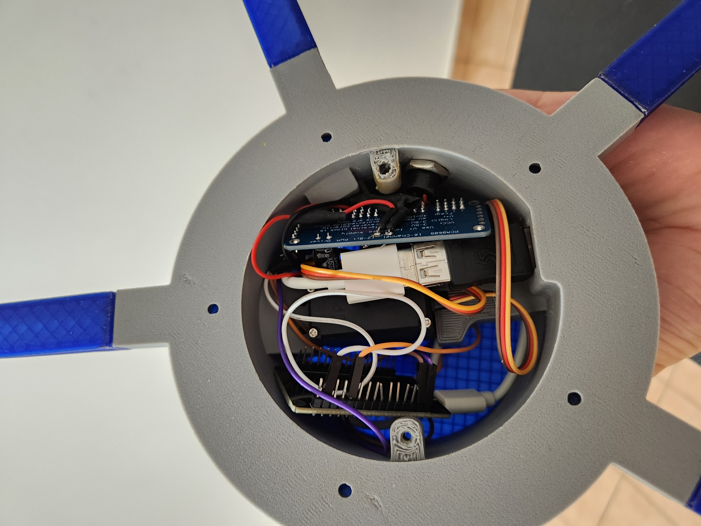
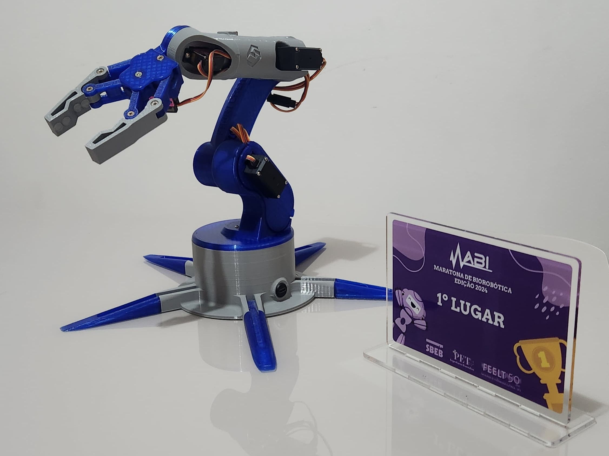
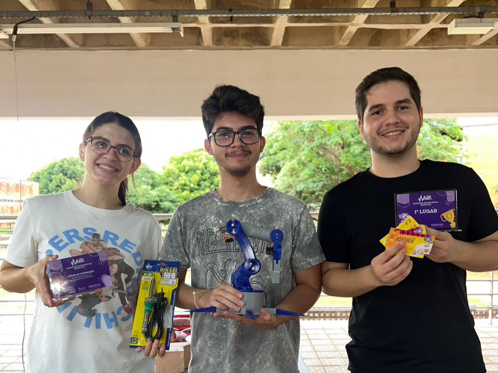

# MABI
## Equipe Poggers

 Este projeto foi desenvolvido para a **Maratona de Biorrobótica (MABI)**, realizada em 2024, 
onde nossa equipe, **Poggers**, alcançou o **primeiro lugar**. Ele envolve o controle de um braço robótico utilizando dois métodos: 
um controle remoto convencional e um sistema baseado em acelerômetro e giroscópio para movimentar a garra.

-----

## Arquitetura do Projeto
O projeto consiste em 3 módulos, sendo eles:

## mabi-sensor:
Captura os dados do sensor MPU6050 e envia o ângulo lido para o mabi-core para processamento. O envio é feito a cada 15 ms via UDP.

## mabi-core:
Recebe os dados de ângulo lido pelo mabi-sensor, gerencia os inputs de gamepad e controla a lógica de movimentação e suavização do robô.

A partir disso, definimos o duty cycle de PWM para controle dos ângulos do robô e enviamos via UDP para o mabi-gateway a cada 15 ms.

Esse módulo é executado no computador (no nosso caso, usamos Linux), e o gamepad também é conectado diretamente no computador.

## mabi-gateway:
Encaminha os dados processados pelo mabi-core para o robô. Os dados são recebidos via UDP por uma ESP32, 
e o controle do robô é feito pelo controlador PWM PCA9685.

-----

## Modelo Físico

O braço foi construído a partir de filamentos de PLA nas cores azul e cinza e possui 6 eixos de liberdade. 
O modelo utilizado pode ser encontrado no link: [Brazo Robótico Arduino DIY con Control de Smartphone 2023](https://cults3d.com/en/3d-model/gadget/brazo-robotico-arduino-diy-con-control-de-smartphone-2023).

Nesse link também há informações sobre quais servo motores utilizar. No nosso caso, utilizamos os servos SG90 e MG995.

O modelo 3D foi feito para ser utilizado com um Arduino UNO, então fizemos algumas adaptações para colocar a ESP32 e o controlador PWM no seu interior.

  
  

  
  

