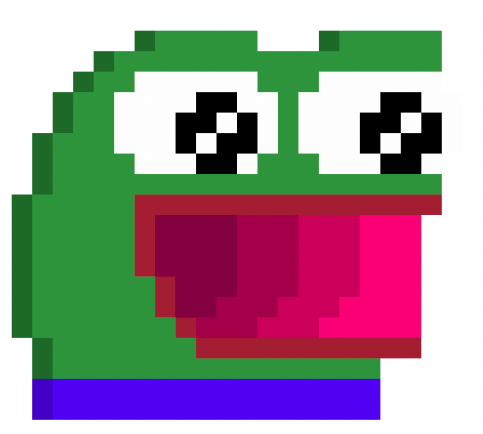
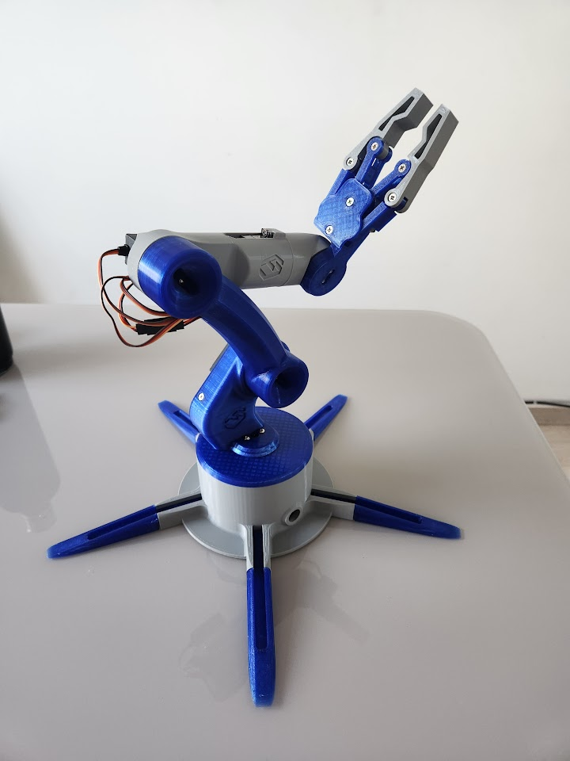
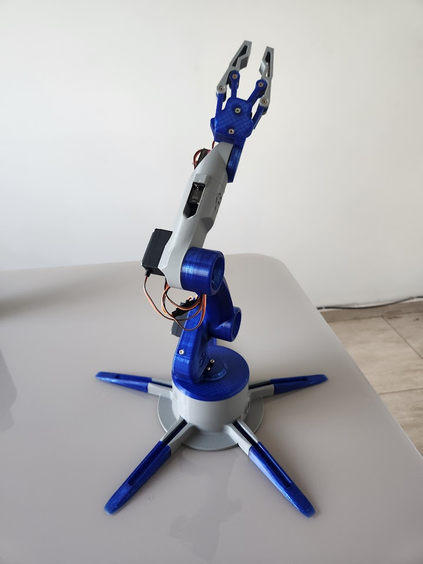
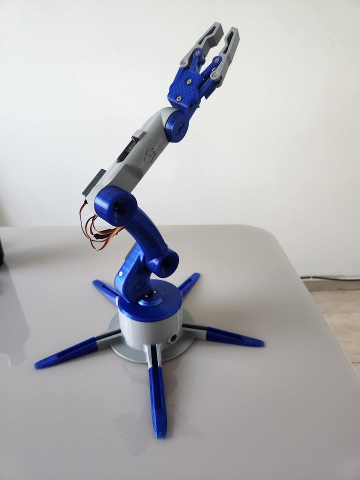

## MABI

  
  

    Este repositório contém o código e a documentação do projeto desenvolvido para a Maratona de Biorrobótica (MABI), organizado pelo PET Biomédica da Universidade Federal de Uberlândia (UFU). O projeto consiste no controle de um braço robótico utilizando dois métodos distintos: um controle remoto convencional e um sistema baseado em acelerômetro e giroscópio para o movimento da pinça. Isso será necessário para cumprir com os desafios propostos para o campeonato.
  

### Funcionalidades

- Controle remoto: movimentação dos eixos do braço e abertura/fechamento da pinça.
- Controle baseado em sensores: utilização de acelerômetro e giroscópio para traduzir movimentos em comandos para o braço.
- Interface com gamepad: suporte para joysticks através da biblioteca Gilrs.
- Movimentação fluida: servos controlados via PWM com ajuste fino dos ângulos.

### Tecnologias e Ferramentas

- Linguagem: Rust 🦀
- Microcontrolador: ESP-IDF (suporte ao ESP32)
- Sensores: Acelerômetro e giroscópio (compatíveis com I2C)
- PWM Driver: PCA9685 para controle dos servos
- Bibliotecas:
    - gilrs: para suporte ao controle remoto
    - pwm_pca9685: para controle PWM
    - rppal: interface com barramento I2C no Raspberry Pi

## Como executar

### Pré-requisitos:
    - Rust e cargo instalados (versão estável).
    - Ambiente configurado para ESP-IDF.
    - Dependências instaladas via cargo.
### Clone o repositório:
`git clone https://github.com/sua-conta/mabi-rs.git`
`cd mabi-rs`

> Copie e cole o https correspondente com o nome da sua conta!

### Compilação e execução:
`cargo build`
`cargo run`

### Modelo físico

  
  
  
  

    Essa é a nossa garra, construída a partir de filamentos de PLA nas cores azul e cinza. Possui vários eixos de liberdade para poder movimentar a garra em diversas direções. Possui apenas dois "dedos" para simular o movimento de pinça, requerido para completar os desafios propostos, que envolvem a sensibilidade e o movimento de pinçar. Os motores utilizados também são suficientes pare que seja possível realizar tarefas que demandem um pouco de tração da garra. Contudo, cabe ressaltar que por ser de um material de plástico, qualquer força realizada de maneira imprudente pode levar ao mal funcionamento de alguma parte, podendo inclusive quebrar a garra robótica.
  

  

  

